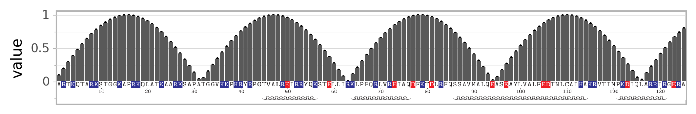

# seqplot
Python tools to plot quantitative data along protein or DNA/RNA sequences or multiple sequence alignments of those.

## Installation via conda
```
conda install -c intbio -c conda-forge -c bioconda seqplot
```


## Usage
### In Jupyter
For Jupyter use see [example.ipynb](example.ipynb) - THIS IS RECOMMENDED
### Stand alone

```
- in development
    
```
Result is



Main function is 
```

```


## Debuging and common problems


## For developers 
---- In development
- Testing can be done as
```
git clone https://github.com/intbio/seqplot.git
docker run   --workdir "/wd" -v "$PWD/seqplot:/wd" intbio/seqplot_test pytest
```
See test_results folder for results.